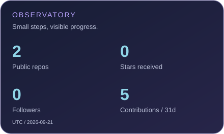
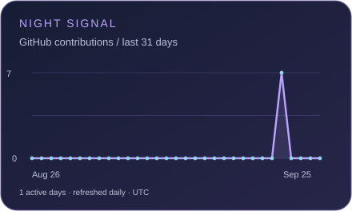

  

<h2 align="center">嗨，我是 alphonso ✦</h2>

  把好奇心写进代码，把想法慢慢变成作品。 
  Somewhere between data and daydreams.

  

  
  &nbsp;
  

 

### ☾ 序章 · The opening chapter

这里是我的小小创作据点，收集数据、记录探索，也为新想法留一个位置。

> 不必一次抵达终点。每一次认真尝试，都是故事的下一页。

  

 

### ✧ 星图 · The observatory

把日常探索，连成一小片星空。

  
  

每日更新 · UTC 日期 · 贡献数遵循 GitHub 日历口径

 

### ✦ 星轨 · A little comet

一条浅青色的小蛇，沿着过去一年的贡献格寻找星光。

  

 

### ◇ 作品集 · Selected work

**[Photovoltaic-glass](https://github.com/alphonso-yunsen/Photovoltaic-glass)** · 光伏玻璃生产数据 
收录 2022 年 1 月至 2024 年 3 月的中国月度产量。

 

  
🌌 彩蛋：给路过这里的你

   
  愿你今天解决一个小问题，也遇见一个让眼睛发亮的新想法。 
   
  <code>save curiosity → start a new adventure</code>

 

  

   
  每一次路过，都留下一点星光。计数代表图片加载，非独立访客。

<a href="docs/PROFILE.md">关于这片星空 · 组件来源与更新说明</a>

