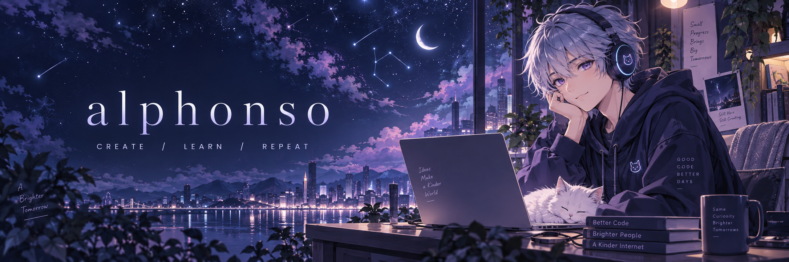
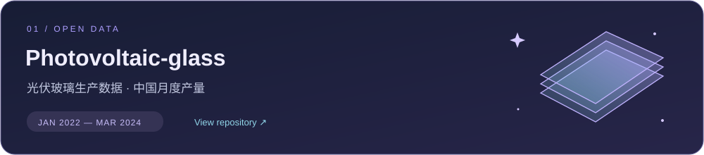

  

<h2 align="center">嗨，我是 alphonso ✦</h2>

  把好奇心写进代码，把想法慢慢变成作品。 
  Somewhere between data and daydreams.

  
  &nbsp;
  

 

### 🌙 序章 · Hello, world

这里是我的小小创作据点，收集数据、记录探索，也为新想法留一个位置。

> 不必一次抵达终点。每一次认真尝试，都是故事的下一页。

 

### ✧ 作品集 · Featured project

**[Photovoltaic-glass](https://github.com/alphonso-yunsen/Photovoltaic-glass)** · 光伏玻璃生产数据 
收录 2022 年 1 月至 2024 年 3 月的中国月度产量。

 

  
🌌 彩蛋：给路过这里的你

   
  愿你今天解决一个小问题，也遇见一个让眼睛发亮的新想法。 
   
  <code>save curiosity → start a new adventure</code>

 

  

